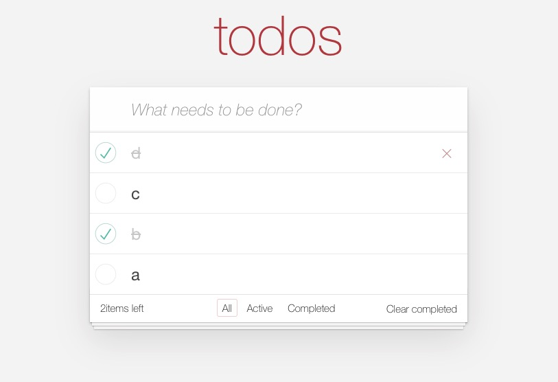

## XReact

XReact 是一个零依赖的 React-like 框架，用法与 React 一致，支持如下特性：

* 支持 class component
* 支持 componentDidMount、componentDidUpdate、componentWillUnmount 等生命周期函数
* 支持 function component
* 支持 useState、useEffect、useCallback、useMemo 等 hooks


## Example
下图是用 [XReact](https://github.com/3examan/xreact) 实现的 todomvc，并且使用自己实现的 [XWebpack](https://github.com/3examan/xwebpack) 进行打包：
* todomvc 在线 Demo：https://3examan.github.io/todomvc



## Getting Started


### Counter (类组件）
```js
import React from 'xreact'
import ReactDOM from 'xreact-dom'

class Counter extends React.Component {
    state = {
        num: 0,
    }

    componentDidMount() {
        console.log('Counter did mount', this.state.num)
    }

    componentDidUpdate() {
        console.log('Counter did update', this.state.num)
    }

    componentWillUnmount() {
        console.log('Counter will unmount', this.state.num)
    }

    handleClick = () => {
        this.setState({
            num: this.state.num + 1,
        })
    }

    render() {
        return (
            <div>
              <div>{this.state.num}</div>
              <button onClick={this.handleClick}>add</button>
            </div>
        )
    }
}

ReactDOM.render(
    <Counter />, document.getElementById('root')
)

```

### Counter (hooks)
```js
import React, { useState, useEffect, useCallback, useMemo } from 'xreact'
import ReactDOM from 'xreact-dom'

const CounterHooks = () => {
    const [num, setNum] = useState(0)

    useEffect(() => {
        console.log('CounterHooks did mount', num)
        return () => {
            console.log('CounterHooks will unmount', num)
        }
    }, [])

    useEffect(() => {
        console.log('CounterHooks useEffect', num)
        return () => {
            console.log('CounterHooks useEffect cleanup', num)
        }
    }, [num])

    const handleClick = useCallback(() => {
        setNum(num + 1)
    }, [num])

    return (
        <div>
          <div>{num}</div>
          <button onClick={handleClick}>add</button>
        </div>
    )
}

ReactDOM.render(
    <CounterHooks />, document.getElementById('root')
)


```

### 运行 demo
```shell
cd examples/todomvc
npm install
npm run build
```
